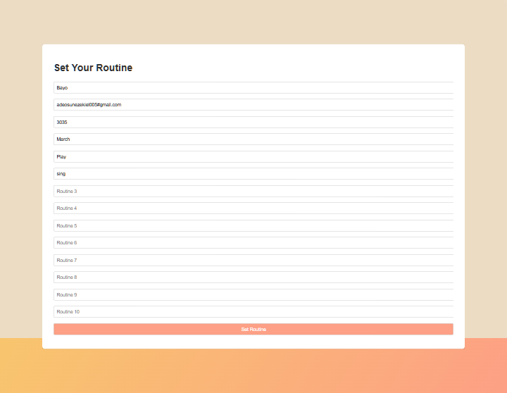
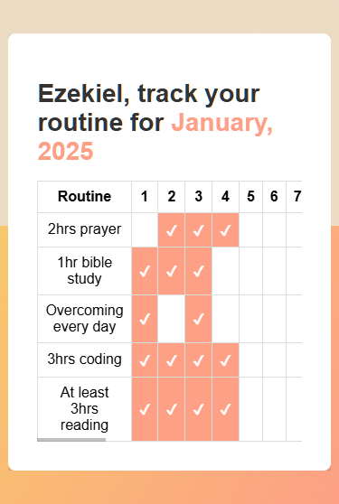
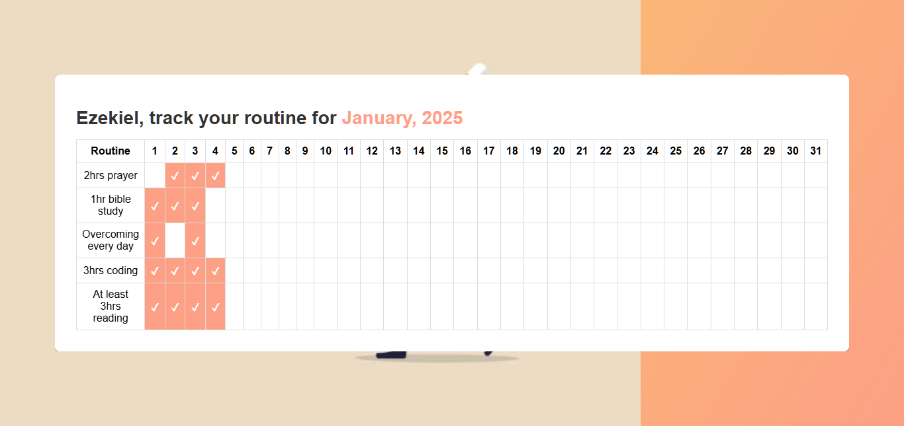

# Routine Tracker App

**Routine Tracker App** is a simple and intuitive application developed with React to help users set, track, and evaluate their daily routines. The app ensures progress is saved and provides a monthly summary email to users for reflection and motivation.

## Features

- **User-friendly Form**: Enter your name, email, month, year, and up to 10 routines to set your monthly goals.
- **Interactive Tracking Page**: Mark your routine progress for each day of the month with a visually appealing table.
- **Persistent Data**: Changes are automatically saved online, ensuring no progress is lost.
- **Monthly Summary Email**: Receive an email at the end of each month with a 


## Screenshots

### Homepage


### Routine Tracker Page



---

## Live Demo

Try out the live demo [here](https://ezekiel673.github.io/routine-tracker_app/).

---

## Installation

1. Clone the repository:
   ```bash
   git clone https://github.com/ezekiel673/routine-tracker-app.git
   ```
2. Navigate to the project directory:

```bash
cd routine-tracker-app
```
3. install dependencies:
```bash
npm install
```

4. Start the development server:
```bash
npm start
```

## Usage
1. Set Your Routines:
    - On the homepage, fill in your name, email, month, year, and up to 10 routines.
    - Click the "Set Routine" button to proceed.

2. Track Progress:
    - On the routine tracking page, click on the cells corresponding to each day of the month to mark progress.
    - Your progress is saved automatically.

3. Monthly Summary:

    - At the end of the month, you'll receive an email with a summary table showing your progress and a brief analysis of your routine adherence.

## Tech Stack
- Frontend: React, CSS
- Backend: Node
- Email Service: emailjs-com


## Folder Structure
```arduino
routine-tracker-app/
├── node_modules/
├── public/
│   └── index.html
├── src/
│   ├── components/
│   │   ├── RoutinePage.js
│   │   ├── HomePage.js
│   │   └── data/
│   │       └── sampleData.js
│   ├── styles/
│   │   ├── App.css
│   │   └── images/
│   │       └── routine_tracker_bg.jpg
│   ├── utils/
│   │   └── emailService.js
│   ├── App.js
│   └── index.js
├── README.md
├── package.json
└── package-lock.json


```
## Contributions
- Contributions are welcome! Please fork the repository and submit a pull request.

## License
- This project is licensed under the MIT License. See the LICENSE file for details.
